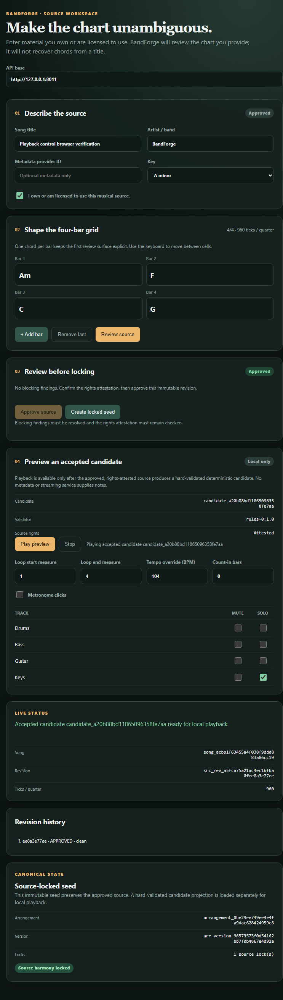

# BandForge

BandForge is a contract-first local application that turns a user-authored or
licensed chord chart into a validated four-piece MIDI/MusicXML rehearsal packet.



## Engineering highlights

- Immutable source revisions, explicit rights attestation, approval, source
  locks, and complete generation lineage.
- Seeded four-piece generation with schema, timing, range, polyphony, and
  source-lock gates before playback or export.
- MIDI type 1, MusicXML, and manifest-backed player-packet exports derived from
  one canonical `ArrangementDocument`.
- Browser playback with mute/solo, loop, metronome, tempo override,
  role-aware samples, and cancellation-safe replay.

## Run and verify

Requires Python 3.11+ and Node.js.

```powershell
git clone https://github.com/nguyenthevietquang07/band-forge.git
cd band-forge
python -m venv .venv
.venv\Scripts\Activate.ps1
pip install -e ".[dev]"

python scripts/run_cycle4_demo.py
python -m pytest -q
python -m ruff check src tests scripts
python -m openapi_spec_validator contracts/openapi.yaml
node --check web/editor.js
```

The committed demo uses the original, title-free `Am | F | C | G` fixture.
Latest local verification: **97 tests passed**, plus lint, semantic OpenAPI,
JavaScript syntax, HTTP/domain demos, and isolated browser playback checks.

## Design and evidence

- [Architecture](docs/ARCHITECTURE.md)
- [Verification details](docs/VERIFICATION.md)
- [Playback cancellation and sampler repair](reports/acoustic-preview-overlap-fix.md)

## Scope

This is a deterministic acoustic-pop MVP, not a trained music model, hosted
product, copyrighted-chart catalog, or claim of professional arrangement
quality. Only authored/licensed material supplies music; title and streaming
metadata never supply chords or notes. FluidR3 sample
[attribution](web/assets/soundfonts/ATTRIBUTION.md) and playback-runtime
[provenance](web/vendor/webaudiofontplayer-1.0.3/PROVENANCE.md) are included.
