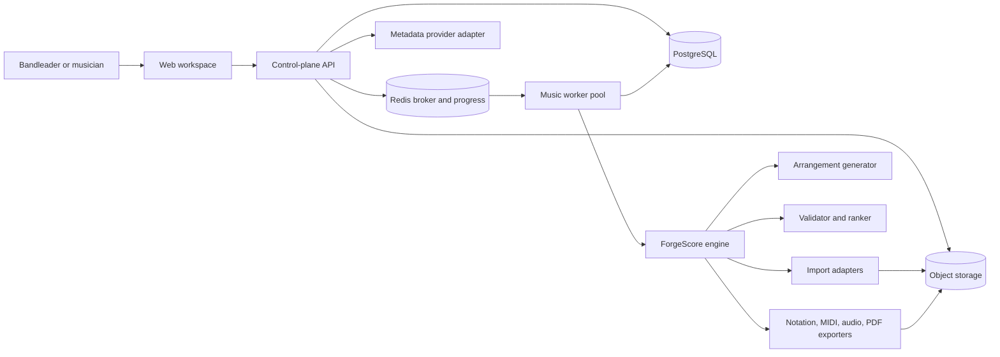
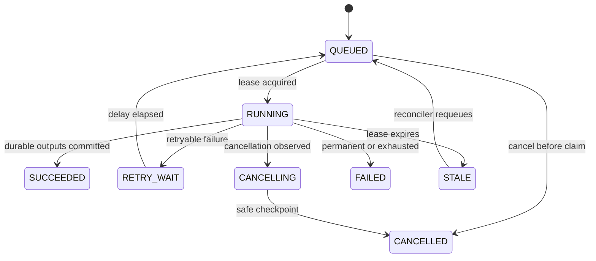

# System Architecture

## 1. Architecture Choice

BandForge starts as a modular monolith with separately scalable asynchronous
workers. The repository contains one web client, one control-plane API, one
music-engine package, and worker processes that invoke music-engine application
services. Modules communicate through typed in-process interfaces or explicit
job payloads; they do not query one another's tables directly.

This choice preserves a short local feedback loop and transactional consistency
while isolating the CPU/GPU-heavy path. It avoids premature microservice
operations but does not trap the music engine inside the web framework.

### Alternatives considered

1. **Single TypeScript application.** Easiest deployment, but Python has the
   stronger symbolic-music and optimization ecosystem. Running Python as ad hoc
   subprocesses would produce weak cancellation, observability, and retry
   behavior.
2. **Modular monolith plus music workers (selected).** Moderate operational
   cost, clear contracts, and independent worker scaling.
3. **Microservices and event streaming.** Maximum isolation, but distributed
   transactions, schema coordination, and operations would dominate the MVP.

## 2. Logical View



## 3. Deployable Units

### `apps/web`

Next.js/React/TypeScript user interface. It owns interaction state, optimistic
editing, notation display through OpenSheetMusicDisplay, and browser playback
through Tone.js. It never contains theory or generation rules.

### `apps/api`

FastAPI control plane. It owns authentication/authorization, request validation,
workspace/song/setlist CRUD, revision concurrency, upload sessions, job
submission, signed artifact delivery, and OpenAPI publication. Long-running work
is always delegated.

### `packages/music-domain`

Pure Python domain types and invariants for rational musical time, harmony,
sections, tracks, events, constraints, provenance, and versions. It has no web,
database, queue, or model-provider dependency.

### `packages/forge-score`

Application services for normalization, style planning, generation, repair,
validation, ranking, and export. External models, databases, and file formats
are behind ports/adapters.

### `workers/music-worker`

Celery workers for import, generation, validation, render, preview, export, and
dataset/evaluation jobs. Queue names and concurrency limits separate short CPU
work, memory-heavy rendering, and optional GPU inference.

### Infrastructure

- PostgreSQL stores identities, workspaces, songs, source revisions,
  arrangement version metadata, job state, validation summaries, setlists,
  audit events, and pointers to artifacts.
- Arrangement documents may be stored in PostgreSQL `jsonb` while small. Large
  immutable snapshots and every binary artifact live in object storage. The
  database stores content hash, size, media type, and object key.
- Redis is a broker and short-lived cache/progress store. PostgreSQL remains the
  durable job and business-state source of truth.
- S3-compatible object storage is private; downloads use short-lived signed
  URLs after authorization.

## 4. Module Boundaries

| Module | Owns | May depend on | Must not depend on |
|---|---|---|---|
| Identity | users, sessions, memberships | database, auth adapter | music engine |
| Catalog | song metadata, setlists | identity, metadata adapter | generator |
| Source Intake | uploads, parsers, review state | object store, music domain | style generator |
| Arrangement | drafts, versions, locks, controls | source intake, music domain | renderer internals |
| Generation | plans and candidates | domain, style library, model gateway | HTTP/database models |
| Validation | findings, repair proposals, scores | domain, rule packs | UI or queue |
| Rendering | MusicXML/MIDI/PDF/audio artifacts | accepted document, exporters | catalog metadata lookup |
| Jobs | lifecycle, retries, cancellation, progress | queue, application services | music rules |
| Evaluation | fixtures, metrics, listening studies | generator, validator | production mutations |

Database tables follow module ownership. Cross-module reads use application
interfaces, not ORM relationships spanning every subsystem.

## 5. End-to-End Generation Flow

```mermaid
sequenceDiagram
    actor User
    participant Web
    participant API
    participant DB
    participant Queue
    participant Worker
    participant Engine
    participant Store

    User->>Web: Generate candidates
    Web->>API: POST generation-jobs + Idempotency-Key
    API->>DB: Validate revision, locks, quota; create QUEUED job
    API->>Queue: Enqueue jobId only
    API-->>Web: 202 job resource
    Queue->>Worker: Deliver jobId
    Worker->>DB: Claim job with lease
    Worker->>Engine: Load immutable source + controls
    Engine->>Engine: Plan, realize N candidates, validate, repair, rank
    Engine->>Store: Write candidate documents and preview artifacts
    Worker->>DB: Commit versions, manifests, findings; mark SUCCEEDED
    Web->>API: SSE progress or GET job
    API-->>Web: Candidate summaries and signed artifact URLs
```

The queue contains identifiers and a small routing envelope, not the full
arrangement. A worker reloads immutable inputs by ID and verifies their hashes.
This limits stale payloads and broker size.

## 6. Job State Machine



Terminal states are `SUCCEEDED`, `FAILED`, and `CANCELLED`. Progress is advisory;
state and outputs are durable. Every handler must be idempotent under duplicate
delivery. The unique key `(workspace_id, job_type, idempotency_key)` prevents a
client retry from creating duplicate work.

## 7. Consistency and Versioning

- Source revisions and arrangement versions are immutable snapshots.
- A mutable draft pointer identifies the current editable revision.
- `PATCH` requires `If-Match` or `baseVersionId`; stale edits return `409`.
- Generation references exact source and arrangement base versions.
- Candidate insertion and job success occur in one database transaction after
  all referenced object-store writes and hashes succeed.
- Orphaned objects are removed by a delayed garbage collector; objects are never
  deleted in the request transaction.
- Accepted versions cannot be patched. Editing or regenerating forks a new draft.

## 8. Failure Handling

| Failure | Behavior |
|---|---|
| Invalid input | `422`, structured field/rule details, no job created |
| Unsupported source feature | import succeeds as `NEEDS_REVIEW` with preserved original |
| Metadata provider unavailable | metadata remains optional; retry with backoff |
| Model timeout | retry a bounded number, then fall back to rules if request permits |
| No valid candidate | job succeeds with `NO_VALID_CANDIDATE` result and findings; no fake ready version |
| Renderer failure | arrangement remains usable; render job fails independently |
| Worker crash | lease expires; idempotent job is requeued |
| Object-store failure | do not commit version metadata; retry job |
| User cancellation | stop at candidate/bar checkpoint and delete unpublished temporary artifacts |

Retries use exponential backoff with jitter and a maximum attempt count by job
type. Validation failures are product outcomes, not infrastructure retries.

## 9. Scaling Path

Scale vertically first, then independently scale worker queues. Read replicas,
CDN artifact delivery, and GPU workers are introduced only after measurement.
The extraction order, if needed, is:

1. renderer/preview worker;
2. trained-model inference service;
3. import/OMR service;
4. control-plane modules only if team or load boundaries justify it.

The `ArrangementDocument` and job contracts are the extraction boundaries.

## 10. Recommended Repository Shape

```text
bandforge/
  apps/
    web/
    api/
  packages/
    contracts/
    music-domain/
    forge-score/
    style-packs/
  workers/
    music-worker/
  infrastructure/
    compose/
    migrations/
    deployment/
  tests/
    contract/
    integration/
    e2e/
    music-fixtures/
  evaluation/
    datasets/
    manifests/
    reports/
    listening-studies/
  docs/
  scripts/
```

## 11. Technology Baseline

The scaffold should pin then-current stable releases in lockfiles. The design
baseline is Next.js + React + TypeScript, Python 3.12+, FastAPI, Pydantic 2,
SQLAlchemy 2, Alembic, PostgreSQL, Redis, Celery 5.6+, music21, pretty_midi/Mido,
OR-Tools where constraint solving is justified, OpenSheetMusicDisplay, and
Tone.js. `note-seq` is not a core dependency because its repository was archived
in May 2026 and its own documentation warns about altered MIDI limits on corrupt
files.

Exact compatibility must be verified from official docs at scaffold time; this
document defines responsibilities, not an unmaintainable frozen lockfile.

