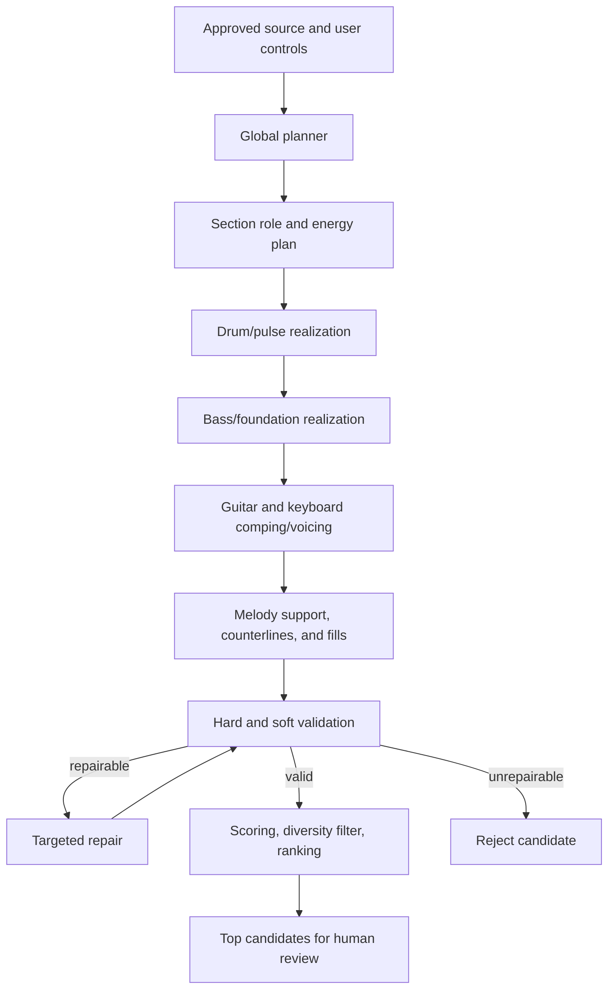

# Generation and Training Architecture

## 1. Design Principle

BandForge is a controlled symbolic arranger, not a prompt-to-audio generator.
Creative generation proposes musical choices; deterministic code owns structure,
locks, feasibility gates, versioning, and export. No model response is accepted
directly as a finished score.

The first useful system should not require training a model from scratch. It
combines a rule/style library, retrieval of licensed patterns, optional model
assistance for high-level plans, constrained realization, validation, repair,
ranking, and human review. A learned note generator is introduced behind the
same interface after evaluation data exists.

## 2. Hierarchical Generation



This order reflects band function. Pulse establishes the rhythmic frame, bass
connects rhythm and harmony, comping instruments divide harmonic space, and
decorative lines are added last. Each stage reads the full shared document and
writes only its assigned tracks/scope.

## 3. Generator Interfaces

```python
class ArrangementGenerator(Protocol):
    def generate(self, request: GenerationRequest) -> list[CandidateDraft]: ...

class Planner(Protocol):
    def plan(self, context: ArrangementContext) -> ArrangementPlan: ...

class TrackRealizer(Protocol):
    def realize(self, plan: ArrangementPlan, track_id: str, seed: int) -> TrackPatch: ...

class ModelGateway(Protocol):
    def produce_structured(self, task: ModelTask, schema: dict, seed: int) -> dict: ...
```

Provider-specific APIs remain in `ModelGateway` adapters. Responses are parsed
against JSON Schema, converted to domain values, and treated as untrusted. The
model never receives object-store credentials or writes arrangement versions.

## 4. Generation Strategies by Phase

### Phase A: deterministic baseline

- Hand-authored, versioned style packs define groove skeletons, role defaults,
  allowed subdivisions, voicing tendencies, phrase/fill locations, density
  ranges, and difficulty transformations.
- Seeded variation chooses among compatible patterns, rotations, omissions,
  passing tones, approach notes, inversions, articulations, and phrase endings.
- A constraint layer maps abstract patterns to actual chords, registers, and
  players.

This is the MVP because it is explainable, testable, CPU-friendly, and capable
of demonstrating the complete product loop.

### Phase B: retrieval plus model-assisted planning

- Retrieve licensed or authored style examples by meter, style, tempo bucket,
  role, density, instrument, and section function.
- A language/reasoning model creates a high-level `ArrangementPlan` only: roles,
  energy, texture, fill points, voicing policy, and reharmonization proposals.
- Deterministic realizers still create the note events.

### Phase C: trained conditional symbolic realizer

- Fine-tune or train a bar/track conditional transformer to generate event
  tokens conditioned on harmony, form, existing tracks, instrument, role,
  difficulty, density, and style.
- Support track-level and bar-level inpainting so scoped regeneration is native.
- Keep planner, hard validators, ranker, and renderer independent of the model.

Research such as MMM shows useful controls from track/bar representations, and
later work on multi-track arrangement supports a sequence-to-sequence framing.
These are research directions, not proof that a dataset or checkpoint is safe
or sufficient for production.

## 5. Tokenization for a Learned Model

Use synchronized bar-major token sequences rather than raw MIDI byte streams.
A conceptual sequence is:

```text
<BOS> <STYLE_POP_ROCK> <METER_4_4> <TEMPO_112>
<SECTION_CHORUS> <BAR_1> <HARMONY_C:maj7@0:1920> ...
<TRACK_DRUMS> <ROLE_PULSE> <DENSITY_3> <EVENTS> ... </EVENTS>
<TRACK_BASS> <ROLE_FOUNDATION> <LEVEL_INTERMEDIATE> ...
<BAR_END> ... <EOS>
```

Requirements:

- bar boundaries and track identities are explicit;
- time is quantized to the canonical grid while expressive offsets are separate;
- harmony and locked source melody are conditioning channels, not predicted
  tokens;
- absent tracks and intentional rests are explicit;
- transposition augmentation happens in sounding pitch before instrument-range
  filtering;
- train/validation/test splits are grouped by underlying work/source to prevent
  near-duplicate leakage.

## 6. Creativity Within Control

Every generation request has:

- an explicit 64-bit seed;
- mode: `SAFE`, `FRESH`, `REHARMONIZE`, `SIMPLIFY`, or `SPICE_UP`;
- target novelty interval;
- temperature/top-p only for model-backed stages;
- locked elements and regeneration scope;
- maximum allowed structural/harmonic deviation.

Variation policy:

| Mode | Preserves | May change | Diversity target |
|---|---|---|---|
| `SAFE` | harmony, form, roles, core groove | voicing, articulation, small fills | low |
| `FRESH` | source locks and form | patterns, texture, register, fills | medium/high |
| `REHARMONIZE` | form and melody locks | approved harmony substitutions | medium |
| `SIMPLIFY` | identity and essential rhythm | density, leaps, voicing size | lower complexity |
| `SPICE_UP` | source and level ceiling | syncopation, extensions, fills | medium |

Generate more candidates internally than are shown. Apply hard validation, then
a diversity filter based on normalized onset/pitch/role features. Candidates
inside a minimum distance from the accepted/base arrangement are duplicates;
candidates outside the user mode's maximum distance are off-brief.

The same seed and generation manifest should reproduce the same symbolic result
for a fixed engine/model build. Cross-provider nondeterminism must be recorded;
the product may promise traceability without promising byte-identical hosted
model output.

## 7. Reharmonization

Reharmonization is a proposal layer with explicit provenance. The first rule pack
may propose:

- inversions and slash-bass motion;
- diatonic passing chords;
- secondary dominants with valid targets;
- ii-V preparation;
- suspended and added-tone colors;
- limited borrowed chords defined by the style pack;
- tritone substitutions only in advanced jazz-compatible modes.

Every proposal includes source chord, proposed chord, rule ID, key context,
melody compatibility result, style fit, difficulty delta, and affected bars. A
hard melody conflict or source-harmony lock rejects it. Reharmonization never
silently changes the user's approved chart.

## 8. Voicing and Playability Realization

Voicing uses an explicit candidate-and-cost formulation. Generate legal voicings
for each harmony, then select a sequence minimizing weighted cost:

```text
cost = voice_leading
     + range_edge_penalty
     + hand_span_or_fret_stretch
     + register_collision
     + doubled_tendency_tone
     + difficulty_overage
     + style_mismatch
```

Hard filters apply first: sounding/written range, maximum polyphony, instrument
shape feasibility, locked top note/bass, and required chord tones. Dynamic
programming is sufficient for many keyboard/guitar progressions; CP-SAT is an
optional adapter for more coupled integer constraints. Since CP-SAT is integer
only, all pitch/time/cost quantities are scaled integers.

Instrument profiles are versioned data, not scattered conditionals. A profile
defines comfortable/absolute range, leap thresholds, polyphony, span/position
limits, endurance heuristics, articulation capabilities, and difficulty bands.
Real musicians can override conservative warnings.

## 9. Dataset Governance

Every dataset requires a registry entry before download or processing:

```yaml
datasetId: groove-midi-v1
sourceUrl: https://magenta.tensorflow.org/datasets/groove
license: CC-BY-4.0
allowedUses: [research, commercial-training-with-attribution]
prohibitedUses: []
attribution: "Groove MIDI Dataset ..."
contentHash: "..."
reviewedAt: "2026-07-19"
reviewer: "..."
```

Initial research candidates:

- Groove MIDI Dataset: expressive drums, CC BY 4.0;
- Slakh2100: aligned multitrack MIDI/audio, CC BY 4.0, useful but synthesized and
  derived from Lakh material;
- POP909: melody/bridge/piano and harmony/beat annotations, repository license
  must be reviewed together with underlying musical-content rights;
- MAESTRO: high-quality aligned piano performance but noncommercial share-alike,
  therefore unsuitable for a commercial model without a separate legal path.

Dataset code license and musical-content rights are distinct. An MIT-licensed
repository does not automatically establish that every encoded song is safe for
commercial training. Spotify explicitly prohibits using Spotify content to
train AI models. No production training run begins without a signed dataset
manifest and rights review.

## 10. Training Pipeline

1. Register and approve datasets.
2. Ingest into a quarantine bucket and verify hashes.
3. Parse MIDI/MusicXML with resource limits; reject malformed files.
4. Normalize instruments, meter, tempo, keys, bars, harmony, and quantization.
5. Remove duplicates and group derivatives by source/work.
6. Derive controls: style, role, density, difficulty proxies, harmonic context.
7. Split by work/source, then freeze split manifest.
8. Tokenize and save tokenizer/version statistics.
9. Train baseline and candidate model with tracked configuration and seeds.
10. Evaluate hard validity, distributional metrics, conditional adherence,
    novelty, and held-out listening/playability.
11. Produce a model card, dataset card, failure examples, and release gate.
12. Deploy behind a feature flag with a rules-based fallback and shadow metrics.

User edits can later train a ranker only under explicit consent. Store semantic
diffs and acceptance signals, not raw private charts in general analytics.

## 11. Model Release Gate

A model cannot become the default unless it:

- beats the deterministic baseline on predeclared conditional-adherence and
  musician preference measures;
- does not increase hard-failure rate;
- meets latency/cost targets on reference hardware;
- passes memorization/near-duplicate and rights review;
- has reproducible training/evaluation manifests;
- supports rollback by model ID;
- has documented weak styles, instruments, meters, and difficulty bands.

